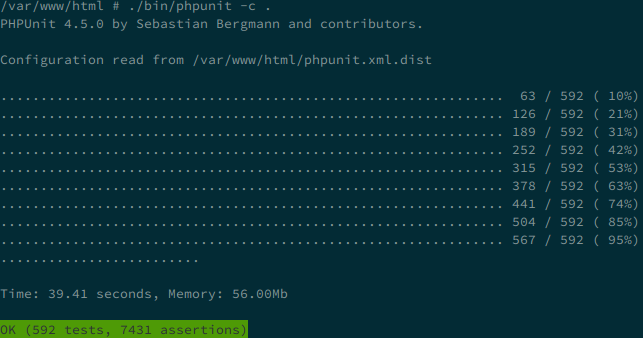

<!-- .slide: data-background="./images/spaghetti.jpg" -->

## From spaghetti to lasagne - writing clean code for Drupal 7 and 8 with Domain Driven Design

Note:

-

--

<!-- .slide: data-background="./images/spaghetti.jpg" -->

## <del>From spaghetti to lasagne - writing clean code for Drupal 7 and 8 with Domain Driven Design</del>
## How custom Drupal development goes straight to hell

--

<!-- .slide: data-background="./images/spaghetti.jpg" -->

## <del>From spaghetti to lasagne - writing clean code for Drupal 7 and 8 with Domain Driven Design</del>
## <del>How custom Drupal development goes straight to hell</del>
## Keeping Drupal's death grips off your code

--

<!-- .slide: data-background="./images/spaghetti.jpg" -->

## <del>From spaghetti to lasagne - writing clean code for Drupal 7 and 8 with Domain Driven Design</del>
## <del>How custom Drupal development goes straight to hell</del>
## <del>Keeping Drupal's death grips off your code</del>
## The PNX approach to custom code

--

<!-- .slide: data-background="./images/home.jpg" -->
## Who am I?

@larowlan

Note:

- by way of introduction
- 8 years of Drupal
- 450+ core patches
- Maintain 4 core modules
- 40+ contrib modules
- security team member
- senior drupal dev at @pnx

--

## Session overview

Note:

- Quick intro to Domain Driven Design
- How we keep business logic out of Drupal code at PNX
- Effort vs benefit analysis for this approach.

--

## What's this Domain Driven Design all about?

Note:

- Domain driven design is an approach to software development
- Coined by Eric Evans in his 2004 book of the same name. 
- Place the primary focus of development on the core business domain and domain logic.
- Not going to go into great detail
- You're here to learn about clean Drupal code, there are books and whole sessions on the topic, so we're going to skim over the theory quickly.

--

## Key concepts

--

## The domain

Note:

- The subject area we're building the software for

--

## Ubiquitous language

- Naming is hard

Note:

- Client (domain expert) and developer derive a common language to discuss the domain in
- The same term can mean different things in different contexts (Node anyone)

--

## Building blocks

--

## Value objects

Note:

- Most text books use Money as an example, it comprises a currency and a value
- No concept of identity
- But concept of equality
- In the past in Drupal we've used keyed arrays for this, but the tide is changing

--

## Entities

Note:

- You know this well. 
- These do have an identity

--

## Repositories

Note:

- Analagous to Drupal's entity storage handlers
- Responsible for retrieval of entitie

--

## Services

Note:

- Specialized operations that have no home in an entity/value object
- Pattern seen in Drupal 8
- Cache bins

--

## Factories

Note:

- When creating a new object requires repeating steps, or the type of object created may vary
- Seen in many software architectures
- e.g logger factory

--

## Domain events

Note:

- An event that triggers an action happened
- Often corresponds with real world events
- Relevant to domain
- InvoiceWasPaid
- ProductWasShipped

--

## Aggregate Roots

Note:

- A collection of objects bound by a root entity
- E.g. A Commerce Order is an aggregate root, it contains line-item entities that you really only interact with via the order.
- Ensures consistency of changes by preventing changes to contained objects from the outside

--

<!-- .slide: data-background="./images/d.jpg" -->
## Drupal & DDD

- or DDDD

--

## An example if you will

--

## Requirements

- Two step form
- Step one collects user's name and address
- Values validated according to business rules
- Step two show's confirmation page
- Submits collected details to external API
- Shows user a ticket ID from response with confirmation message

--

## A naive approach (D8)

<pre><code class="php">
class SomeForm extends FormBase {
  public function buildForm() {
    // This calls either buildStep1 or buildStep2 depending on form state.
  }

  protected function buildStep1() {
    // Here you build all the forms by specifying the fields one by one.
  }

  protected function buildStep2() {
    // Here you build the preview of the values for submission.
  }

  public function validateForm() {
    // Here you call validateStep1 if appropriate.
  }
  
  protected function validateStep1() {
    // Here you validate the address is valid etc.
  }

  public function submitForm() {
    // Here you just proxy to submitStep1 or 2 depending on form state.
  }

  protected function submitStep1() {
    // Here you set form state to step 2 and rebuild the form.
  }

  protected function submitStep2() {
    // Here you create the connection and submit to the external API.
  }

}
</code></pre>

Note:

- Talk to the code.

--

## A naive approach (D7)

<pre><code class="php">
function some_form() {
  // This calls either some_form_step_1() or some_form_step_2() depending on form state.
}

function some_form_step1() {
  // Here you build all the forms by specifying the fields one by one.
}

function some_form_step2() {
  // Here you build the preview of the values for submission.
}

function some_form_validate() {
  // Here you call some_form_validate_step1() if appropriate.
}

function some_form_validate_step1() {
  // Here you validate the address is valid etc.
}

function some_form_submit() {
  // Here you just proxy to some_form_submit_step1() or some_form_submit_step2() depending on form state.
}

function some_form_submit_step1() {
  // Here you set form state to step 2 and rebuild the form.
}

function some_form_submit_step2() {
  // Here you create the connection and submit to the external API.
}

</code></pre>

Note:

- My skin is crawling - is yours?

--

<!-- .slide: data-background="./images/game-over.jpg" -->
## This is the highpoint of the design

Note:

- Is it even a high point?
- So yeah, you met the requirements
- But over time?
- How do you test this?

--

<!-- .slide: data-background="./images/downhill.jpg" -->
## It's all downhill from here

Note:

- What if the requirements change?
- How can you adapt?
- Can you get fast feedback?
- Do you submit against actual APIs to test?

--

<!-- .slide: data-background="./images/virus.jpg" -->
## A bit about frameworks

Note:

- See a framework is like a virus
- It needs to infect you to live
- It needs you to depend on it and use it
- It can't wait to get its cold hands on you
- Like a dealer giving out free samples
- Once you're 'hooked' a framework is forever

--

<!-- .slide: data-background="./images/zombie.jpg" -->
## So back to our requirements

Note:

- See you've mixed presentation (Drupal) with business logic
- You've trampled on your boundaries
- Drupal has you in it's Death grips

--

<!-- .slide: data-background="./images/lasagne.jpg" -->
## Layered architecture

Note:
- In spaghetti architecture - everything is intertwined
- In layered arch - information only travels one way
- Drupal can know about your domain 
- But not the other way

--

<!-- .slide: data-background="./images/onion.jpg" -->
## Drupal is just one layer

- The UI layer
- Drupal is not your application

Note:
- Drupal is just one way to interact with your domain
- Tests are another
- Command line is another
- API may be another

--

<!-- .slide: data-background="./images/wall.jpg" -->
## Build a wall

- composer is your friend

Note:
- To ensure information only flows one way
- composer.json for your project src folder
- Write domain objects in isolation
- Composer project in D8
- include autoload in settings.php in D7

--

## Identify domain objects

- A submission aggregate root?
- A user entity?
- An address value object?
- A submitter service?
- A submission view model value object?
- A submission data transfer object?

Note:

- Model your code on the domain
- Use terms that are ubiquitous
- These will appear out of conversations with client

--

## Beware anaemic domain models

Note:
- Domain objects should be more than a bag with getters and setters
- They should model your domain
- They should contain behaviour
- They should enforce requirements

--

## What always happens:
### - Your requirements change

Note:
- client testing, things change
- someone outside the project team tests their address and it isn't allowed
- You know the joke, a QA tester walks into a bar 
- Then she orders {0/9999/-1/NULL/lizard} beers.

--

## A real world example

- A valid AU address:
- You must provide either Street Address, with optional Unit/Level/Lot or Property Name or Postal Box Number
- You must provide a suburb
- Postcode must be either a 4 digit number or a three digit number starting with 8
- State must be provided and match valid values
- Street type must be provided if not a postal box and match valid values

--

## Testing with  <em>everything in the form</em>  approach

Note:
- imagine testing each of those in an end-to-end test
- because remember there is no concept of an address?
- there is just $form_state['values']
- the only way you can test is by submitting the form
- again and again

--

## Let's consider an address value object

- good

Note:
- Its something that has meaning in the domain
- It has behaviour

--

## Data transfer object

- better
- home for your validation logic

Note:
- take data from user input and convert into valid object
- ensure your value objects and entities are always valid
- Drupal needs to do this with entities/forms
- Use an existing library (symfomy/validator)
- Or keep it simple and roll your own

--

## How does our code look now?

<pre><code class="php">
class SomeForm extends FormBase {

  // ...

  protected function validateStep1($form, FormStateInterface $form_state) {
    $submissionAggregateDTO = SubmissionAggregate::fromUserValues($form_state->getValues());
    foreach ($submissionAggregateDTO->getViolations() as $field_name => $message) {
      $form_state->setErrorByName($field_name, $message);
    }
    $form_state->set('submission_dto', $submissionAggregateDTO);
  }

  // ...
}
</code></pre>

Note:
- getting better, still a bit to go
- we can now test the validation *without* a form submission

--

## Submitter service

Note:
- contract for how to send submission to API
- so write a contract - an interface
- type hint it

--

## Services in Drupal 7 and 8

- Drupal 7
> - service_container.module
> - registry_autoload.module
- Drupal 8 - built in

Note:
- both have ways of modifying services at test time
- what does this give you?

--

## Revisiting the code.

<pre><code class="php">
class SomeForm extends FormBase {

  protected $submitter;
  protected $flash;
  public function __construct(SubmitterInterface $submitter, ErrorDisplayInterface $flash) {
    $this->submitter = $submitter;
    $this->flash = $flash;
  }
  // ...

  protected function submitStep1($form, FormStateInterface $form_state) {
    $submissionDTO = $form_state->get('submission_dto');
    $submission = $submissionDTO->toSubmission();
    $result = $this->submitter->submit($submission);
    if ($result->hasErrors()) {
      $this->flash->displayErrors($result->getErrors());
      return;
    }
    $form_state->setRedirect(...);
  }

  // ...
}
</code></pre>

--

## Mocking

<pre><code class="php">
MockSubmitter implements SubmitterInterface {
  public function submit(SubmissionIntereface $submission) {
    // Do what you like here to validate your logic.
  }
}
</code></pre>

Note:
- test your code can handle anything the service might throw at it
- simulate all scenarios
- without round trip to the actual service

--

## Requirements change again

Note:
- We've now cleaned up the validation and submission
- But not the form
- client adds a new field
- now you need to update your validation
- and your entity
- and your form
- metadata is scattered

--

## Enter annotations

Note:
- you've seen them in Drupal 8
- comments with special meaning
- now we decide we want to put metadata with objects
- we don't want to put them in our domain, they're not a domain concern
- but we can put them on our data transfer object

--

## Form factory

- internally we've built form factories
<pre><code class="php">Formfactory->getFormForObject($some_object);</code></pre>
- Works by reading annotations on properties
<pre><code class="php">
class JewelleryItem {
 
  /**
   * The shape.
   *
   * @var string
   * @Title("Shape")
   * @FieldType("select")
   * @Options("objectShapes")
   * @WithEmpty(TRUE)
   */
  protected $shape;
  //..
}
</code></pre>

--

## Revisiting the code

<pre class="php"><code>
class SomeForm extends FormBase {
  //..
  protected function buildStep1($form, FormStateInterface $formState) {
    $form['submission'] = [
      '#type' => 'object',
      '#default_value' => $formState->get('submission_dto') ?: SubmissionAggregate::new(),
    ];
  }
  //..
}
</code></pre>

Note:
- type => object
- default_value => from previous submission or new 
- form factory builds out the fapi stuff (obviously this is Drupal)
- you can do the same with entities that you need field api/views/search api

--

## View models

- remember the preview on step 2?
<pre class="php"><code>
function somemodule_theme() {
  return [
    'someobject' => [
      'variables' => ['someobject' => NULL],
    ],
  ];
}
</code></pre>

Note:
- think of it as a cut-down version of the entity for formatting sake
- avoid logic in your controller/template
- avoid presentation logic in your domain object
- single responsibility - take a domain object and apply presentation logic
- integrates with Drupal theme system well, theme hook, one variable, the view model
- twig supports methods
- for d7, you need to call getters direct

--

## View models
<pre class="twig"><code>

  
{{ submission.getSubject }}

  ...

</code></pre>

--

## What about integration tests?

Note:
- you need to have at least one test to make sure the wiring is correct
- but this should be the minority of tests in your suite
- testing pyramid

--

## Are we doing this in  production?

Note:
- Yes including D7

--

## Sounds like effort?

Note:
- Yes it is
- Suited to complex projects
- Pays for itself in the long run

--

## The payoff

From a D7 site 

--

## CQRS in Drupal*

- aka how do I build views of Domain objects without SQL

<pre>* bonus material</pre>

Note:
- if you're doing entity API integration (similar annotation approach), loading entities is being repo
- i.e. not in Drupal
- but you need views.
- search api
- build reporting/uis with views, but without bending your entities to Drupal
- store them anywhere (no need for SQL)(tests above are stored in dynamodb)
- write projection is different to read projection (Search api)

--

## Questions & Resources?

- https://www.youtube.com/watch?v=QaIGN_cTcc8
- https://www.youtube.com/watch?v=K1EJBmwg9EQ
- https://www.youtube.com/watch?v=bTawx0TGIj8
- https://leanpub.com/ddd-in-php (worth the money)
- https://www.amazon.com/Domain-Driven-Design-Tackling-Complexity-Software/dp/0321125215
- ping me on irc in #drupal-au to discuss more

--

## Image credits

<ul class="tight">
<li>https://www.flickr.com/photos/145281386@N08/31948574674/</li><li>
https://www.flickr.com/photos/le-topographe/2740566971/</li><li>
https://www.flickr.com/photos/calsidyrose/20333492154/</li><li>
https://www.flickr.com/photos/photographrdotnet/4604914266/</li><li>
https://www.flickr.com/photos/laradanielle/3628056534/</li><li>
https://www.flickr.com/photos/melissawarhol/6202636338/</li><li>
https://www.flickr.com/photos/niaid/14440817981/</li><li>
https://www.flickr.com/photos/rvoegtli/5688343678</li><li>
https://www.flickr.com/photos/lox/32878005/</li>
</ul>
