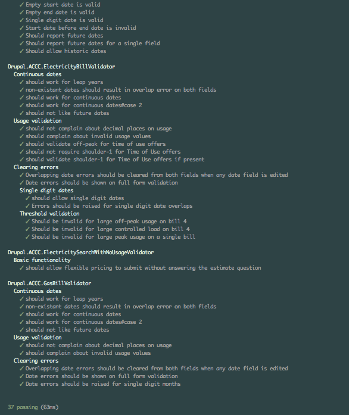

# testing in D8

## fast and reliable

---

> New test features are the best bit of Drupal8 - larowlan

--

> I agree - benjy

---

## The layers

---

## PHPUnit

--

## Fast

--

## Forces better design

--

## Force decoupling

--

## Where we've used it well

- ACCC Lib
- Police Lib

--

## Planning for decoupled

--

## Composer solves the separate repo issue

---

## KernelTestBase

--

## Tests run against boostrapped site

--

## Drupal is not installed

--

## You need to install schemas etc

--

## Fast

--

## Don't need to mock the universe

--

## No browser*

* *you can test controller behaviour though

--

## Example projects

* WCC
* Amaysim

--

## Ideal for TDD

---

## BrowserTestBase

--

## A Guzzle powered browser

--

## Submit forms

--

## Interact with the page

--

## Installs Drupal

--

## Too slow

* 2 minutes for a test

--

## Example projects

* too slow - none

---

## {ProjectName}TestBase

--

## BrowserTestBase without setup

--

## Runs against installed site

--

## Fast

* < 20 seconds for large test

--

## You need to do cleanup

* Avoid leaking between tests
* (No different to behat)

--

## Goodbye Behat

--

## Good riddance

--

## Example projects

* Amaysim
* WCC

---

### JavascriptTestBase

--

## PhantomsJS powered browser

--

## Functional Javascript tests

--

## Timing is everything

--

## Works well on client projects

--

## Example projects

* Amaysim

---

## {ProjectName}JavaScriptTestBase

--

## Same again

---

## Mocha

--

## Same as PHPUnit

* But for Javascript

--

## Forces decoupled design

--

##Fast

--

## Example projects

* ACCC consumer

---

## Us

--

## We should

* Allow for tests in estimate
* Write them first
* Favour fast tests
* Share recipes

--

## Point of difference

--

## Premimum === Quality

--

## Walk the walk

--

## Wins

* Contrib bugs
* One project failing
* Refactoring

